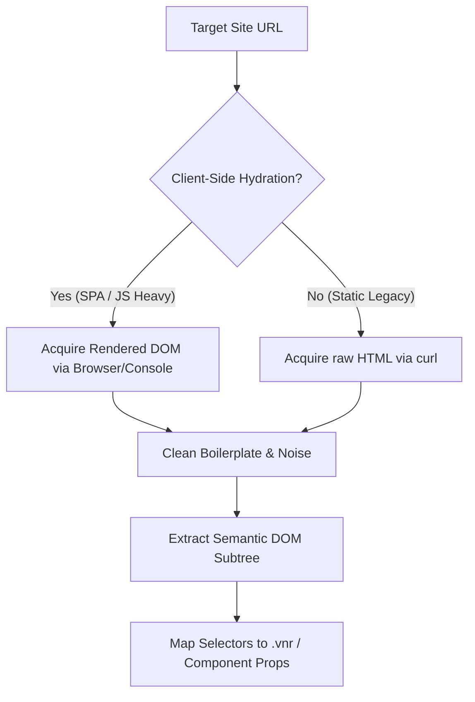

# Page Scraper & DOM Auditor Skill

ROLE: Senior DOM Analyst & Scraping Architect  
CONTEXT: Site Package Manager (SPM) Ecosystem  
GOAL: Provide a standard protocol for extracting, cleaning, and mapping legacy HTML pages to modern component selectors, ensuring agents focus on semantic elements and do not get overwhelmed by massive, unreadable raw HTML code.

---

## 1. The Scraping Friction Problem

Raw HTML pages on legacy websites frequently contain tens of thousands of lines of boilerplate code:
- Large inline scripts (`<script>`) and analytics trackers.
- Massive inline styling blocks (`<style>`) and SVG paths (`<svg>`).
- Redundant headers, navigation sidebars, base64 image strings, and tracker pixels.

Processing these raw files wastes token limits, creates semantic noise, and prevents clean selector mapping. Furthermore, modern pages hydrated via client-side JavaScript (React, Vue, SPA) do not contain their dynamic structures inside raw `curl` outputs.

---

## 2. The DOM Auditing Protocol

When analyzing a target environment, agents must follow this 4-step protocol:



### Step 1: Hydration Assessment
Determine if the target page depends on client-side JavaScript for rendering its critical elements:
- Check if search results, tables, or item lists are missing from the raw `curl` response.
- If JS-dependent, use the browser runtime or a Playwright headless script to fetch the *rendered* HTML page source (`document.documentElement.outerHTML`) instead of the static server response.

### Step 2: Boilerplate Stripping
Before analyzing selectors or mapping bindings, clean the HTML content. Run a local Node/Python script or use standard terminal commands to strip:
- **Scripts & Styles**: Remove all `<script>`, `<style>`, `<noscript>`, and `<link>` elements.
- **SVGs**: Strip `<svg>` children (or replace with simple `<svg>...</svg>` placeholders).
- **Inline Images**: Replace base64 data URLs in `src` attributes with standard mock URLs.

*Node.js cleaning snippet:*
```javascript
const cleanHtml = (html) => {
  const dom = new JSDOM(html);
  const doc = dom.window.document;
  doc.querySelectorAll('script, style, noscript, svg, iframe, link').forEach(el => el.remove());
  doc.querySelectorAll('img[src^="data:"]').forEach(img => img.setAttribute('src', 'https://mock.com/img.png'));
  return dom.serialize();
};
```

### Step 3: Semantic Subtree Isolation
Identify the **critical layout bounds** of the legacy application. Locate the main container node:
- E.g., `#content`, `main`, `.grid-container`, `#results-table`.
- Discard all outer headers, structural footers, and advertising sections unless they are specifically targeted for replacement or wrapping.
- Isolate this container and save it as your **primary testing snapshot** (e.g. `fixtures/page-snapshot.html`), reducing the file size by 90%.

### Step 4: Map Selectors and Binds
Use the cleaned semantic HTML to define your Veneer Spec bindings:
1. **Container Selector**: Target the primary container for reconstruction (`reconstruct "#target" -> UiComponent`).
2. **Interactive Boundaries**: Identify form targets, search fields, and input values (`bind defaultValue: "form input[name='q'] | attr:value"`).
3. **List Loop Selections**: Locate the repeat templates for children lists (`child items { selector: "tr:not(.header)"; }`).
4. **Metadata Extraction**: Map table cell text nodes to properties (`bind price: "td.price | text | cleanNumber"`).

---

## 3. Selector Mapping Conventions

When mapping selectors in `.vnr` files, adhere to these reliability rules:

| Selector Type | Recommendation | Example | Rationale |
| :--- | :--- | :--- | :--- |
| **Containers** | Prefer unique IDs | `#mw-navigation` | Highest spec lookup speed. |
| **Table Rows** | Avoid generic class names; use structural exclusions | `table.highlightable tr:not(.header)` | Prevents capturing header metadata as data cells. |
| **Hyperlinks** | Target anchor tag explicitly | `td.title a | attr:href` | Ensures the click proxy and URL extractor target the correct node. |
| **Forms** | Anchor selectors inside parent containers | `#searchform form` | Avoids form scoping conflicts with global elements. |

---

## 4. Test Suite integration

Every environment folder under `environments/` MUST have a `fixtures/` directory:
- `fixtures/page-snapshot.html` — The cleaned, isolated DOM subtree (not the 100k line raw file).
- This ensures that local validations (`spm validate` and `spm apply`) run instantly and focus on semantic element assertions.
